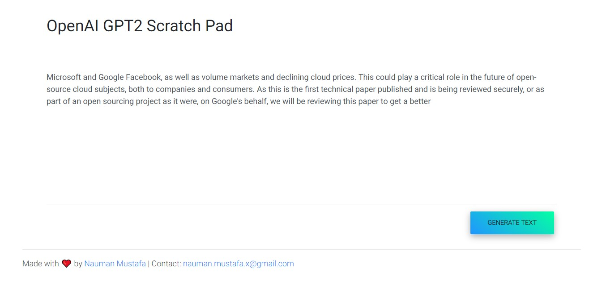

# GPT2 XY

This repository uses HuggingFace's GPT2 Implementation and exposes an creates a nice user interface for testing GPT2 power. Even though it may not be exactly as good as authors' original tensorflow implementation, it still surprises sometimes. 

**Update**: Only GPT-2 Small (117M paramter) model is supported on Cloud Run. Medium/Large or XL cannot be run on Cloud Run due to memory limits. 

## Get Started

To get started on this project, follow these steps:

* Clone: `git clone https://github.com/NaxAlpha/gpt-2xy.git` and `cd gpt-2xy`
* Install Dependencies: `pip install -r requirements.txt`
* Download the gpt related data: python download.py
* Run server: `python main.py`
* Open Web Browser and visit: `http://localhost:8080/`
* Type `Microsoft and Google` and press `GENERATE TEXT`
* Enjoy!

You may also want to build and run this project in docker container

* Build: `docker build -t gpt-2xy .` (will take some time)
* Run: `docker run -p 8080:8080 --rm -d gpt-2xy`

If successful, you will see something like this:

## Full Tutorial

This repository contains code for my medium tutorial on [Deploy Machine Learning Model in Google Cloud using Cloud Run](https://medium.com/@NaxAlpha/deploy-machine-learning-model-in-google-cloud-using-cloud-run-6ced8ba52aac)
